+++
title = 'Compiler Design 1'
date = 2025-04-12T01:46:05+05:30
draft = false
summary = 'a brief about compiler design'
+++

# Compiler Design : 1 

Before we start on designing a compiler, a genuine question that would come to mind would be **wtf is even a compiler?**, to understand that lets start with the question **what is an interpreter?**

## 1. Understanding the Machine and the Need for Interpreters

Consider a machine , machine is a very vague term so we have to describe what do i even mean by a "machine", for our understanding of this module we would define our machine to be a [Turing Machine](https://en.wikipedia.org/wiki/Turing_machine#Overview), so essentially a machine that can compute a set of instructions. I am going to call these instructions a "low level instruction". so any "program" with "low level instructions" can execute on the machine,

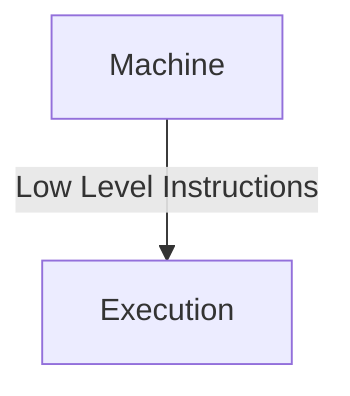

However, programming directly in low-level instructions is difficult and hard for humans to understand. To address this, **high-level instructions** and **high-level programming languages** were invented.

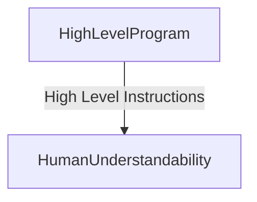

A program written in high-level instructions cannot be directly executed on a low-level machine. This necessitates something in the middle: the **interpreter**.

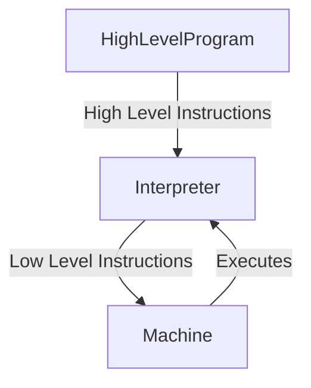

The interpreter itself is a program that needs to be implemented using the low-level instructions of the underlying machine so that it can execute. The interpreter's role is to take a high-level program and execute its instructions.

**How an Interpreter Works:**

An interpreter typically **fetches the next instruction** from the [IR](https://en.wikipedia.org/wiki/Intermediate_representation), **interprets it**, **executes it**, and then moves to the next instruction. During execution, the interpreter takes two inputs:
*   The **program** with high-level instructions.
*   **Input data** required for the program to execute.

As it executes, the interpreter generates **output**, which could be printing to the screen, sending commands to a printer, or any other form of result.

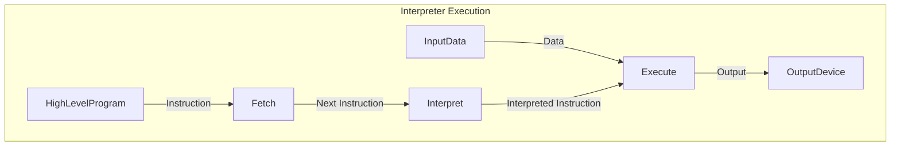

## 2. Functional Representation of an Interpreter

Functionally, we can think of an interpreter as a function that takes two arguments: a **program** (in high-level instructions) and **data**, and produces an **output**.

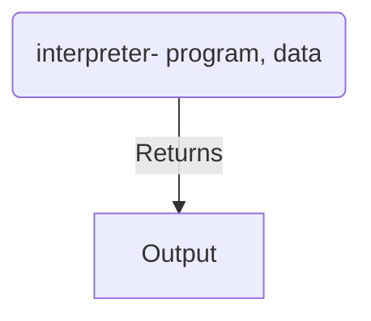

This can be **staged (or curried)** such that the interpreter first takes the **program** and returns a new function. This returned function then takes the **data** and produces the **output**.

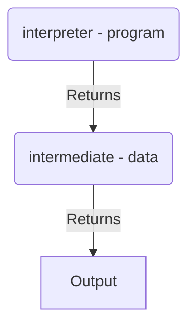

This staged representation is useful because the **same program is often executed on different sets of data**.

## 3. Compiled Function and the Compiler

A **compiler** is something that takes a **high-level program** as input and returns an **executable**.

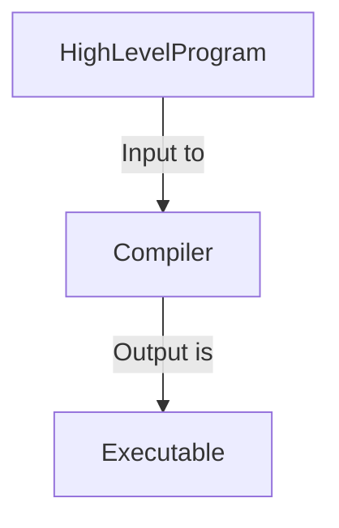

The **executable** itself is a program written in **low-level instructions** so that it can run directly on the machine. When the executable is run on the machine, it takes **data** as input and produces the **same output** as if the interpreter had executed the original high-level program with the same data.

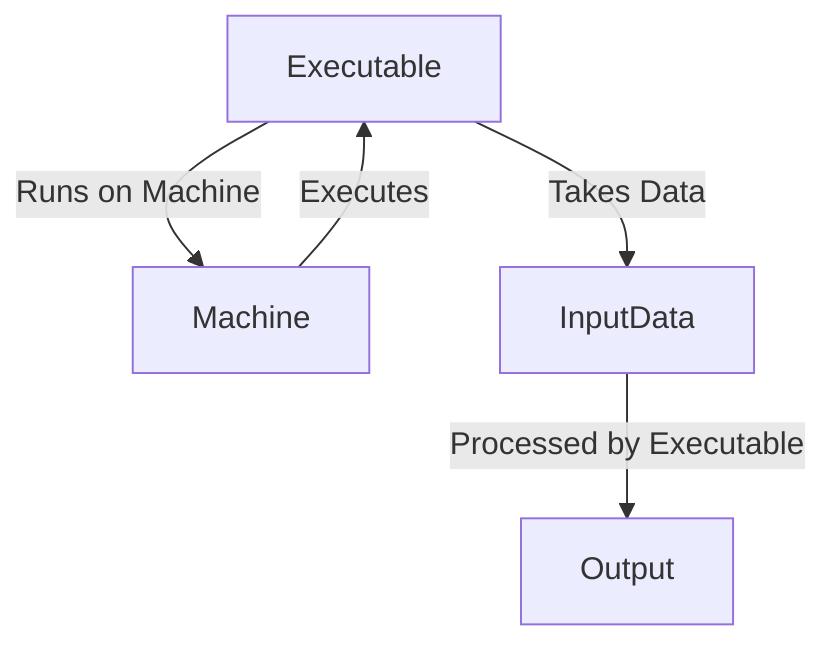

Notice that the function from **data** to **output** is the same in both the interpreted and compiled scenarios. This suggests that when we apply the interpreter to a high-level program, we are in a way generating an executable (at least in terms of functional representation).

## 4. Executable as a Specialization of the Interpreter

The **executable** can be viewed as a **specialization of the interpreter** for a given program.

Think of it this way: The interpreter is a general-purpose program that can execute any program written in a specific high-level language. When we compile a particular high-level program, we are essentially taking the interpreter and tailoring it specifically for that one program. The result is the executable, which is optimized (hopefully) to run that specific program more efficiently.

## 5. Partial Evaluation or Specialization

**Partial evaluation** (or specialization) is a technique where a function that takes multiple inputs is evaluated with respect to some of its inputs being known (the **static part**), resulting in a new, specialized function that only needs the remaining inputs (the **dynamic part**).

Let's say we have a function `prog(i_static, i_dynamic)` that returns an output. If `i_static` is known and remains constant across multiple runs, we can partially evaluate `prog` on `i_static` to obtain a new program `prog_star(i_dynamic)`. `prog_star` is called the **residual program** and is a specialized version of `prog`.

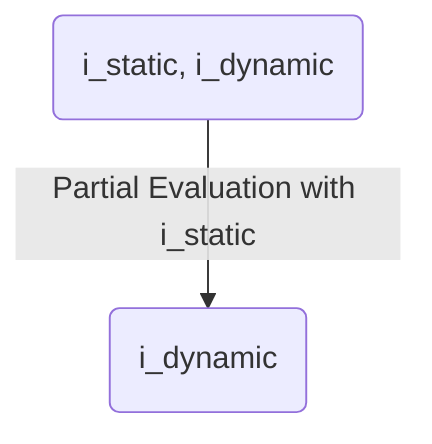

The advantage of partial evaluation is that the specialized program `prog_star` is often **faster or more efficient** than the original program `prog` because the computations involving the static input have already been performed.

## 6. The First Futamura Projection

The first **Futamura Projection** formalizes the relationship between interpretation and compilation using the concept of partial evaluation. It states that **specializing an interpreter for a given source code (high-level program) yields an executable**.

Consider the `interpret` function, which takes a `program` and returns a function that takes `data` and returns `output`.

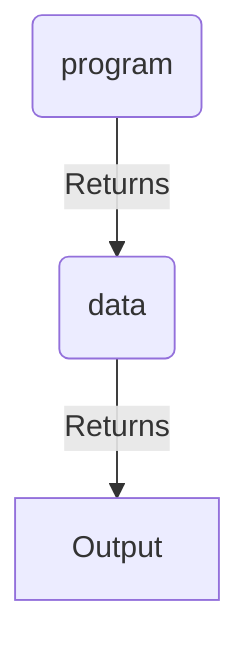

The first Futamura Projection suggests that we can have a **specializer** function that takes the `interpret` function and a specific `program` as input and produces an **executable**, which is a function that directly takes `data` and returns `output`.

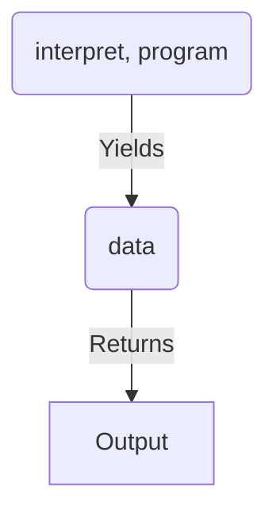

In essence, **compilation is the process of partially evaluating the interpreter with respect to the source program**. The resulting executable is a specialized version of the interpreter for that particular program.

This process is meaningful only if executing the specialized executable directly on data is **faster** than running the general-purpose interpreter on both the program and the same data for multiple runs.

**Important Note:** A trivial specialization of the interpreter on a high-level program would be to simply bundle the entire interpreter code and the high-level program into a single file. However, this kind of specialization is **not beneficial** in terms of performance. True compilation aims for a more optimized and efficient executable.

## 7. Takeaways from Module 1

*   An **interpreter executes high-level programs** by interpreting and executing instructions step-by-step.
*   A **compiler translates a high-level program** into a low-level **executable** that can run directly on the machine.
*   The **executable can be seen as a specialized version of the interpreter** for a specific program.
*   **Partial evaluation is a technique to specialize programs** by pre-computing results based on static inputs.
*   The **first Futamura Projection states that compilation is the partial evaluation of the interpreter with respect to the source program**, resulting in an executable.
*   The **goal of compilation (partial evaluation) is to produce an executable that runs more efficiently** than interpreting the program directly, especially when the same program is run multiple times with different data.

***