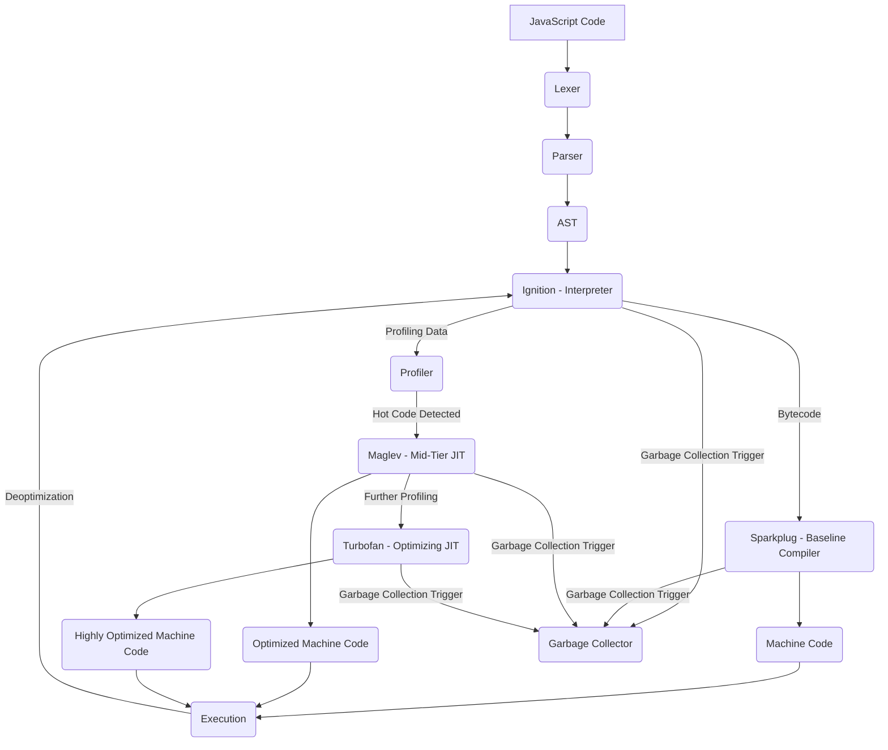
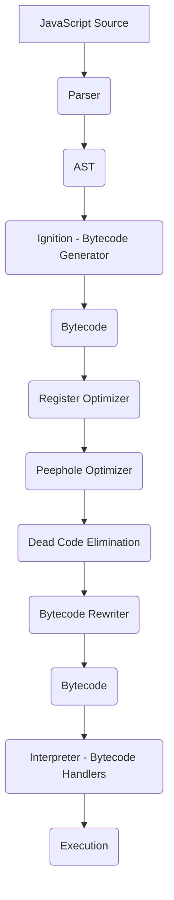
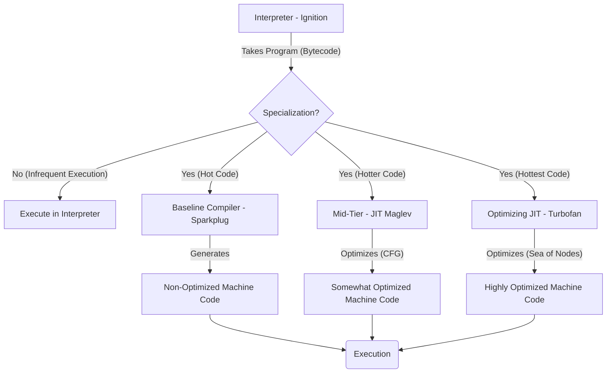
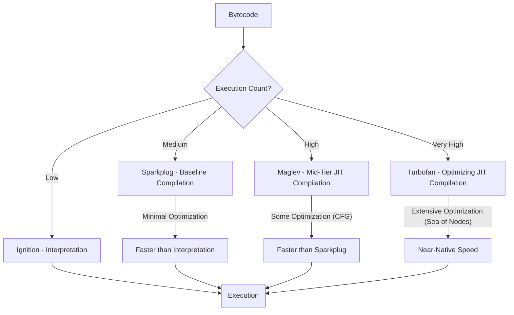

+++
title = 'Compiler Design Principles in V8'
date = 2025-04-12T02:29:05+05:30
draft = false
summary = 'A post to correlate an high level overview of v8 with the previous compiler design post'
+++

# Compiler Design Principles in V8

This note explores how the fundamental concepts of compiler design, particularly the idea that **compilation can be viewed as the partial evaluation of an interpreter**, are manifested in the V8 JavaScript engine. It draws upon the principles discussed in [Compiler Design Module 1](./Compiler-Design-1.md) and the descriptions of V8's architecture and execution pipeline from various sources.

## 1. Compilation as Partial Evaluation: A Recap

In [Compiler Design Module 1](./Compiler-Design-1.md), it was established that an [**interpreter**](./Compiler-Design-1.md#1-understanding-the-machine-and-the-need-for-interpreters) executes high-level programs by fetching, interpreting, and executing instructions. Functionally, an interpreter can be seen as a function that takes a program and data as input and produces output. This can be staged so that the interpreter first takes the program and returns a specialized function that then takes the data to produce the output. This staging is also known as currying. This makes sense because typically the same program is executed on several different types of data.

A [**compiler**](./Compiler-Design-1.md#3-compiled-function-and-the-compiler), on the other hand, takes a high-level program and returns an [**executable**](./Compiler-Design-1.md#4-executable-as-a-specialization-of-the-interpreter). The executable itself needs to be written using low-level instructions so it can execute on the machine. The executable, when run on the machine, takes data and returns output, just like the interpreter. The executable can be seen as a **specialization of the interpreter** for a given program.

**Partial evaluation** or **specialization** is a technique where a function with multiple inputs is evaluated with respect to its static (known) inputs, yielding a new, specialized program (residual program) that only needs the dynamic (remaining) inputs. The first Futamura Projection states that **specializing an interpreter for a given source code (high-level program) yields an executable**. This specialization is meaningful if the resulting executable runs faster than the original interpreter running on both the program and the data.

## 2. V8 JavaScript Engine: An Overview

**V8 is Google's open-source high-performance JavaScript and WebAssembly engine**, written in C++. It is used in Chrome and Node.js, among others. V8 implements ECMAScript and WebAssembly and runs on various operating systems and processors. Its primary goal is to execute JavaScript with high performance, often achieving near-native speeds through various optimizations, including Just-In-Time (JIT) compilation. The V8 engine employs a pipeline to execute JavaScript code:

*   **Lexer:** The [Lexer](./Intro-V8.md#js-engine-pipeline-v8) takes in the JavaScript code and divides it into tokens such as keywords, constants, operators, and variables. This process is called [**lexical analysis**].
*   **Parser:** The parser utilizes these tokens to generate an **Abstract Syntax Tree (AST)** and also validates the JavaScript source code syntax. The AST is a tree representation of the program.
*   **Ignition:** Ignition is an **interpreter** responsible for generating bytecode from the AST and then running it. Its design is based on a register-based machine. You can view V8's bytecode using the `--print-bytecode` flag with `d8`. Every function in V8 is represented as a `JSFunction`, which contains a `bytecode` object (`BytecodeArray`).
*   **Sparkplug:** Sparkplug is a **baseline compiler** that generates non-optimizing machine code. It performs **Peephole optimization**, which involves replacing small sequences of instructions with equivalent, more performant ones. Sparkplug compiles directly from bytecode in a single linear pass and is more of a dispatcher to per-bytecode machine code generation functions.
*   **Maglev:** Maglev is a **mid-tier JIT compiler** that performs some optimizations and generates somewhat optimized machine code. It fills the gap between Sparkplug's fast but non-optimized code and Turbofan's highly optimized but slower compilation. Maglev uses **Control Flow Graph (CFG)** as its Intermediate Representation (IR) and employs techniques like Static Single Assignment (SSA) and Loop-invariant code motion (LICM) (experimental).
*   **Turbofan:** Turbofan is a **high-end optimizing JIT compiler** that applies extensive optimizations and generates highly optimized machine code. It uses an IR called **Sea of Nodes**, representing both control flow and data flow. Turbofan's pipeline involves various phases like TyperPhase, inlining, and SimplifiedLowering.
*   **Profiler:** The Profiler collects runtime information and detects "hot" code (code executed frequently). Based on the execution count, hot code is sent to Maglev or Turbofan for JIT compilation. The runtime information is stored in the **Feedback Vector**, which is used by the JIT compilers for speculative optimization.
*   **Deoptimizer:** The Deoptimizer handles cases where JIT-compiled code becomes invalid due to failed assumptions, falling back to the Ignition interpreter for execution.
*   **Garbage Collection (GC):** GC is necessary for memory management in V8, freeing objects that are no longer in use. V8 uses a **Generational Garbage Collector**, dividing the heap into NewSpace and OldSpace. The **Scavenger** handles garbage collection in NewSpace, while **Mark-compact** is used for OldSpace. Orinoco is the codename for the effort to make V8's garbage collector mostly concurrent and parallel.
*   V8 also implements **Heap Sandbox (SBX)** or Ubercage, a software-based sandbox for protection against memory corruption bugs. It replaces raw pointers with offsets to tables stored outside the sandbox. Various pointer types like Compressed Pointer, Sandboxed Pointer, and Trusted Pointer are used within the sandbox.

## 3. Applying Compiler Design Principles to V8

The V8 pipeline clearly demonstrates the principles of compilation and interpretation discussed in "Compiler Design Module 1 : Compilation is partial evaluation of the Interpreter".

### 3.1. Ignition as the Interpreter

**Ignition directly acts as the interpreter in V8's execution pipeline**. It takes the AST generated by the parser and produces platform-independent **bytecode**. This bytecode is then executed by Ignition's **bytecode handlers**, which are small, specialized pieces of machine code. The interpreter loop fetches, decodes, and dispatches bytecode instructions to these handlers. These handlers are implemented in low-level machine code to minimize overhead and maximize performance.

Ignition is a **register-based virtual machine**, using registers to hold intermediate values. It conceptually has an infinite register file, allocating registers as needed onto the stack frame. Bytecode operands often specify these registers, representing local variables or temporary expressions. Parameters passed to functions are also treated as registers.

Ignition also utilizes an **internal implicit register called the accumulator**. Certain bytecode instructions operate on the accumulator, which can improve efficiency for left-to-right expression evaluation by avoiding unnecessary storing of intermediate values in registers.

The process of **bytecode generation** involves walking the AST and generating bytecode for each node. This pipeline includes several optimization steps:

*   **Register Optimizer:** Tries to avoid unnecessary loads and stores of registers.
*   **Peephole Optimizer:** Tries to merge multiple common bytecode patterns into a single "uber bytecode".
*   **Dead Code Elimination:** Omits bytecode that can never be executed (e.g., after a return statement before a branch or label).
*   **Bytecode Rewriter:** Rewrites the bytecode.

A key motivation for introducing Ignition was to address issues with **memory usage** and **startup speed**. Previously, V8 would compile large chunks of machine code even for functions run only once, leading to significant memory overhead. **Ignition's bytecode is much more concise than machine code**, reducing memory usage, especially for infrequently executed functions. By compiling the entire script to bytecode upfront, V8 can also reduce the overhead of **lazy compilation** and multiple parsing of the same function. The initial approach of Ignition was specifically for low-end devices to optimize for size.

Furthermore, Ignition aims to reduce the **complexity** of the compiler pipeline by making the bytecode the central **source of truth** for optimization, simplifying the interaction between the interpreter and the optimizing compilers. This allows Turbofan to optimize directly from the bytecode.

### 3.2. JIT Compilation as Partial Evaluation

The **JIT compilers in V8 (Sparkplug, Maglev, and Turbofan) embody the concept of compilation as partial evaluation**.

*   **Sparkplug**, while a compiler, performs minimal optimization (Peephole optimization). It can be seen as a relatively straightforward specialization of the interpreter's bytecode execution for a specific function. It takes the bytecode (the output of the "program" processed by the initial stage) and directly generates machine code.
*   **Maglev and Turbofan take this specialization further by performing significant optimizations**. They analyze the bytecode and runtime information (collected by the profiler) to make assumptions and rewrite the code into more efficient forms (using IRs like CFG and Sea of Nodes) before generating optimized machine code. This aligns with the idea of **partial evaluation of the interpreter on the program**. The JIT compilers act as "specializers" that leverage the static input (bytecode) and runtime feedback to produce specialized "executables" (optimized machine code).

### 3.3. Levels of Specialization

V8 employs multiple tiers of JIT compilation, representing different levels of specialization and optimization:

*   **Sparkplug** provides a quick initial compilation with minimal overhead, offering a faster start than pure interpretation but less optimization.
*   **Maglev** offers a balance between compilation speed and optimization level, filling the gap between Sparkplug and Turbofan.
*   **Turbofan** performs extensive analysis and optimization, resulting in highly efficient machine code but with a longer compilation time.

This tiered approach allows V8 to progressively specialize and optimize code based on its execution frequency, reflecting a sophisticated application of the partial evaluation principle.