+++
title = 'FlareOn11'
date = 2025-04-11T14:25:45+05:30
draft = false
summary = 'Writeups for FlareOn-2024'
+++
# Flare-On 11 (2024)

Get the binaries from the [Flare-On website](http://flare-on.com/files/Flare-On11_Challenges.zip) and [Flare-On 11 stats and solutions by Mandiant team](https://cloud.google.com/blog/topics/threat-intelligence/flareon-11-challenge-solutions).

- [1 Frog](./FlareOn11.md#1-frog)
- [2 Checksum](./FlareOn11.md#2-checksum)
- [3 Aray](./FlareOn11.md#3-aray)
- [4 Mememaker 3000](./FlareOn11.md#4-mememaker3000)
- [5 SSHD](./FlareOn11.md#5-sshd)

## 1 Frog

Run `frog.py`. You need to move the frog through a maze to reach the statue.


Reading the provided challenge code i found the following snippet:
```py
victory_tile = pygame.Vector2(10, 10) 
```
along with the flag generation function : 
```py
def GenerateFlagText(x, y):
    key = x + y*20
    encoded = "\xa5\xb7\xbe\xb1\xbd\xbf\xb7\x8d\xa6\xbd\x8d\xe3\xe3\x92\xb4\xbe\xb3\xa0\xb7\xff\xbd\xbc\xfc\xb1\xbd\xbf"
    return ''.join([chr(ord(c) ^ key) for c in encoded])
```

so i just ripped the flag generation function out and called it with the `victory_tile` coordiates as function arguments as such:
```py
def GenerateFlagText(x, y):
    key = x + y*20
    encoded = "\xa5\xb7\xbe\xb1\xbd\xbf\xb7\x8d\xa6\xbd\x8d\xe3\xe3\x92\xb4\xbe\xb3\xa0\xb7\xff\xbd\xbc\xfc\xb1\xbd\xbf"
    return ''.join([chr(ord(c) ^ key) for c in encoded])

print(GenerateFlagText(10,10))
```
and the result was
Flag: ```welcome_to_11@flare-on.com```

## 2 Checksum

We are basically provided with a PE executable called `checksum.exe`, upon running it outputs:

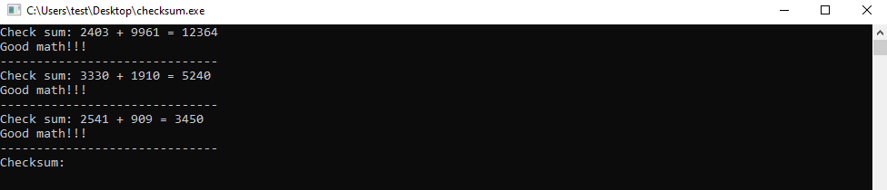

Without wasting time I cracked open this program in IDA Pro, turns out it’s written in Golang with full debug symbols. Program’s got exactly three non-library functions: `main_main`, `main_a`, and `main_b`. That’s it. Either this thing is gloriously simple, or it’s hiding eldritch horrors inside b. But hey, at least it looks like I won’t need to sell my soul to reverse engineer it. Small mercies.

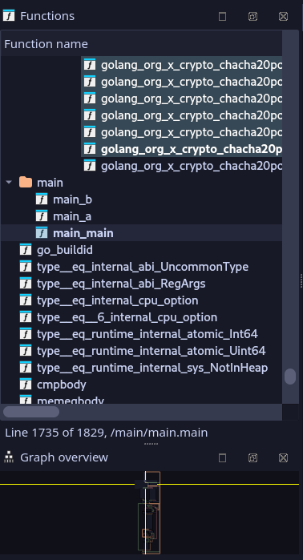

Since it is Go, let’s go to `main_main` function. First, we are met with a for loop. In each loop, it generates two random values and ask the user to input the sum. It does this for a random number of times. However, this part does not contribute to the following process, so we can safely ignore it.

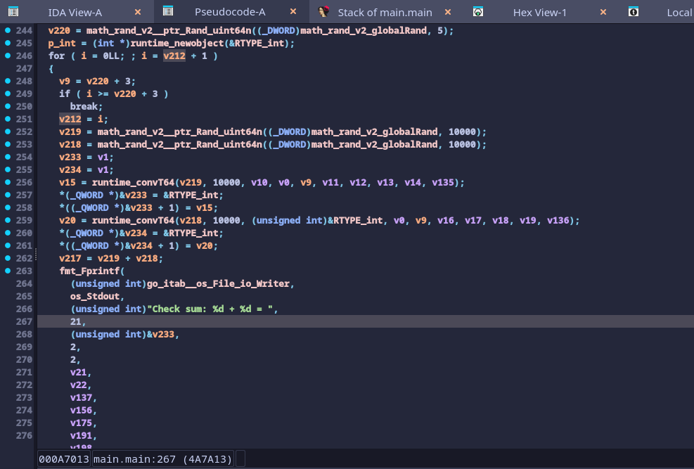

After the for loop, it asks for a new input "Checksum." Based on the checks after input, it needs to be a hex string which decodes to a 32-byte data. Using this decoded 32-byte data as a key, it creates a XChaCha20-Poly1305 AEAD cipher (notice the X here). Then, it passes in a data buffer with the name `main_encryptedFlagData` along with its size.

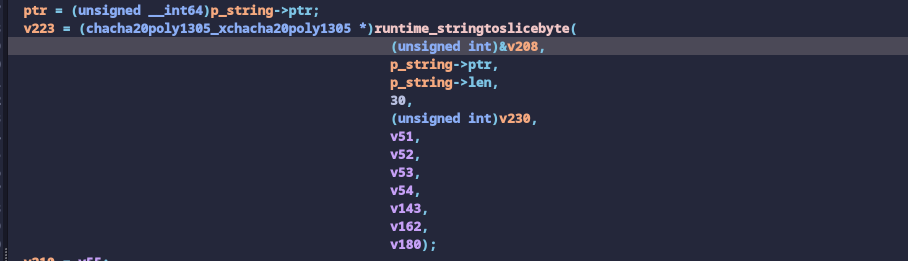
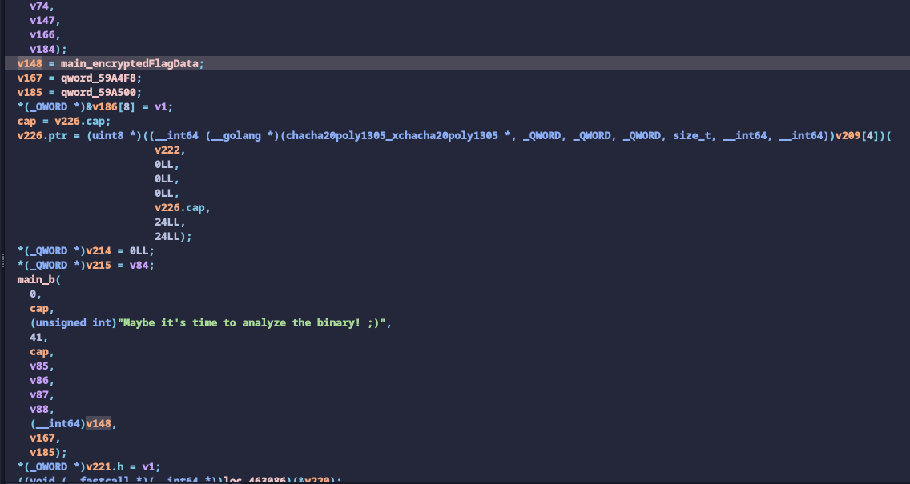
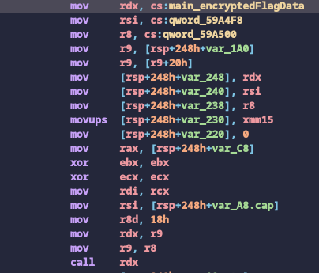

Looking a bit deeper into the library’s documentation, we see that the crypto algorithm’s key size must be 32-bytes with 2 different nonce sizes. The 12-byte nonce is used for the standard ChaCha20-Poly1305 variant, while the 24-byte nonce is used for the XChaCha20-Poly1305 algorithm.

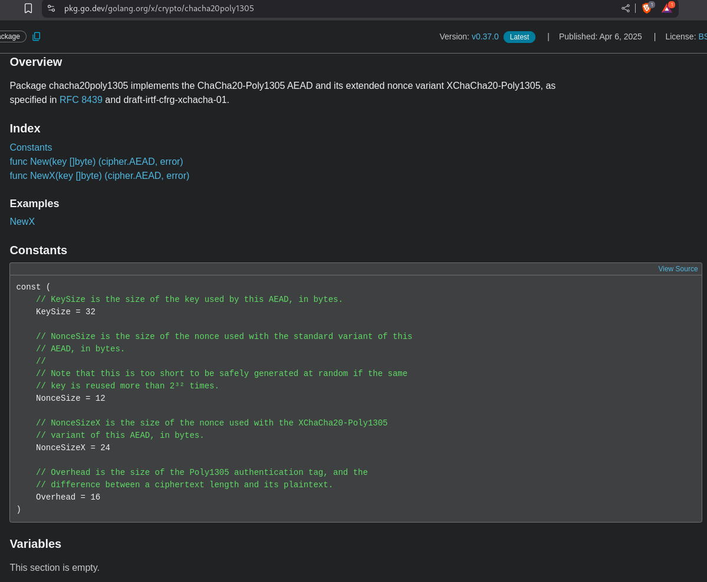

We don’t know the key yet. It is also non-brute-forceable as it is 32 bytes long. Let’s continue reading the code:

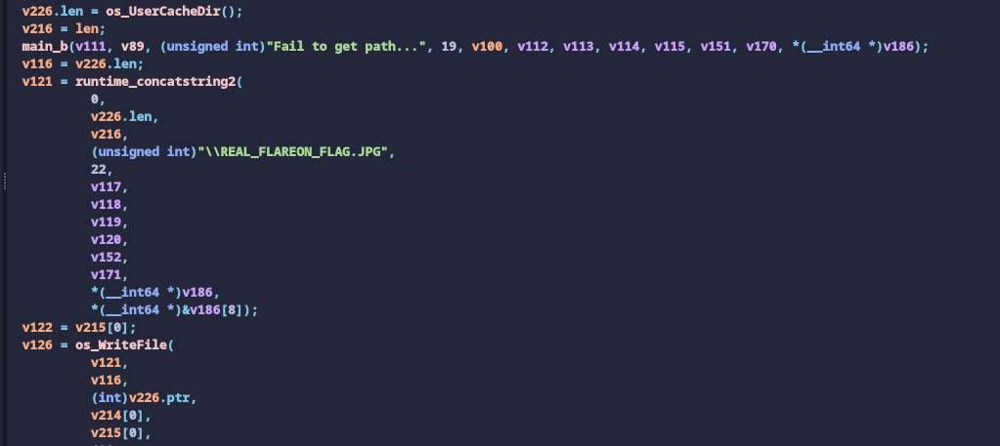

First, it uses SHA 256 to hash the decrypted data. Then, it turns the hash into hex and compare it with the input hex string (checksum). If it is the same, it calls function main.a with the input hex string. If the function call returns true, it will finally output the decrypted data to 
```go
{os.UserCacheDir()}\REAL_FLAREON_FLAG.JPG.
```
So let’s take a look at what `main_a` does—it’s actually not that complicated. We see that it first XOR’s the input string with a constant string `FlareOn2024`. Then it encodes the XOR’d string to base64, and compare it with a constant string `cQoFRQErX1YAVw1zVQdFUSxfAQNRBXUNAxBSe15QCVRVJ1pQEwd/WFBUAlElCFBFUnlaB1ULByRdBEFdfVtWVA==`. 

```go
for ( i = 0LL; a2 > i; ++i )
  {
    a5 = v9;
    v17 = v15;
    v18 = i - 11 * ((__int64)((unsigned __int128)(i * (__int128)0x5D1745D1745D1746LL) >> 64) >> 2);
    v19 = v15[i];
    if ( v18 >= 0xB )
      runtime_panicIndex(v18, i, 11LL);
    v10 = "FlareOn2024bad verb '%0123456789_/dev/stdout/dev/stderrCloseHandleOpenProcessGetFileTypeshort write30517578125bad argSizemethodargs(reflect.SetProcessPrngMoveFileExWNetShareAddNetShareDeluserenv.dllassistQueuenetpollInitreflectOffsglobalAllocmSpanManualstart traceclobberfreegccheckmarkscheddetailcgocall nilunreachable s.nelems=   of size  runtime: p  ms clock,  nBSSRoots=runtime: P  exp.) for minTrigger=GOMEMLIMIT=bad m value, elemsize= freeindex= span.list=, npages = tracealloc( p->status= in status  idleprocs= gcwaiting= schedtick= timerslen= mallocing=bad timedivfloat64nan1float64nan2float64nan3float32nan2GOTRACEBACK) at entry+ (targetpc= , plugin: runtime: g : frame.sp=created by broken pipebad messagefile existsbad addressRegCloseKeyCreateFileWDeleteFileWExitProcessFreeLibrarySetFileTimeVirtualLockWSARecvFromclosesocketgetpeernamegetsocknamecrypt32.dllmswsock.dllsecur32.dllshell32.dlli/o timeoutavx512vnniwavx512vbmi2LocalAppDatashort buffer152587890625762939453125OpenServiceWRevertToSelfCreateEventWGetConsoleCPUnlockFileExVirtualQueryadvapi32.dlliphlpapi.dllkernel32.dllnetapi32.dllsweepWaiterstraceStringsspanSetSpinemspanSpecialgcBitsArenasmheapSpecialgcpacertracemadvdontneedharddecommitdumping heapchan receivelfstack.push span.limit= span.state=bad flushGen MB stacks, worker mode  nDataRoots= nSpanRoots= wbuf1=<nil> wbuf2=<nil> gcscandone runtime: gp= found at *( s.elemsize= B (";
    v11 = (unsigned __int8)aTrueeeppfilepi[v18 + 3060];
    *(_BYTE *)(a5 + i) = v11 ^ v19;
    v9 = a5;
    v15 = v17;
  }
  v20 = v9;
  v21 = encoding_base64__ptr_Encoding_EncodeToString(
          runtime_bss,
          v9,
          a2,
          a2,
          a5,
          (_DWORD)v10,
          v11,
          v12,
          v13,
          v23,
          v24,
          v25);
  if ( v20 == 88 )
    return runtime_memequal(
             v21,
             "cQoFRQErX1YAVw1zVQdFUSxfAQNRBXUNAxBSe15QCVRVJ1pQEwd/WFBUAlElCFBFUnlaB1ULByRdBEFdfVtWVA==");
  else
    return 0LL;
}
```

So to get the input, all we need to do is to reverse this process:
```py
import base64
key = b"FlareOn2024"
decoded_data = base64.b64decode('cQoFRQErX1YAVw1zVQdFUSxfAQNRBXUNAxBSe15QCVRVJ1pQEwd/WFBUAlElCFBFUnlaB1ULByRdBEFdfVtWVA==')
xored = bytes([b ^ key[i % len(key)] for i, b in enumerate(decoded_data)])
print(xored)
```

Gives us :

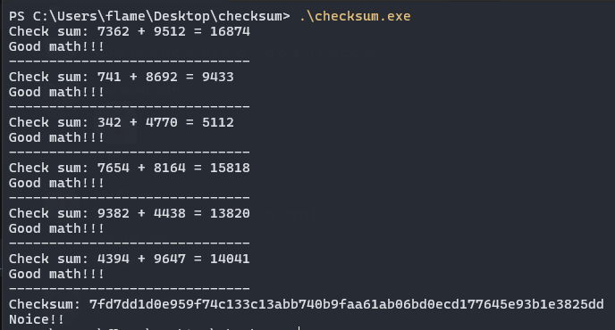

As we read previously , In the final part of the program’s main function, the program calls the API `os.UserCacheDir` to retrieve the
default root directory that stores user-specific cached data. On Windows, this path is the `%LocalAppData%` path. The program then proceeds to write the decrypted data content to the file `REAL_FLAREON_FLAG.JPG` in the `%LocalAppData%` folder.

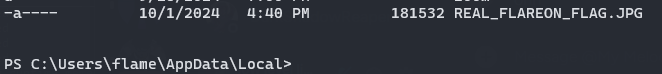

Below is the image `REAL_FLAREON_FLAG.JPG` in the `%LocalAppData%` directory, which gives us the flag of `Th3_M4tH_Do_b3_mAth1ng@flare-on.com`.

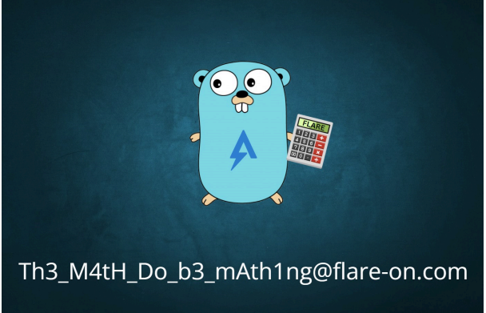

# 3 Aray

We are given a single `aray.yara` file. [YARA](https://virustotal.github.io/yara/) file is basically a rule file for detecting certain file patterns. It is used widely in detecting malicious programs/files by antivirus softwares.
For the YARA file we are given, if we look at the condition section, we can see it’s basically hundreds of rules chained together using and. For a target file to match, we essentially want to satisfy all the conditions.

We can split the conditions into a few groups:
- First, there's a condition that checks if the file is exactly 85 bytes long.
- Second, there's a condition that checks if the MD5 hash of the file is b7dc94ca98aa58dabb5404541c812db2.
- Next, there are conditions that use normal math operations. These are pretty straightforward, and we can directly turn them into Z3 expressions.
  Here are a few examples:
    ```
        filesize ^ uint8(11) != 107 becomes filesize ^ flag[11] != 107

        uint8(55) & 128 == 0 becomes flag[55] & 128 == 0

        uint8(48) % 12 < 12 becomes ULT(flag[48] % 12, 12)
    ```

- Finally, we have conditions that involve hashes. At first, these look tricky because they seem hard to solve with Z3. But if you look closer, you’ll notice all  the hash checks are done only on 2 bytes at a time.

Because of this, we can actually write our own functions to "solve" these hashes by brute-forcing or testing values until they work. first let write a simple awk query with sed and sort to extract the conditions:

```sh
awk 'NR==n-1' n=$(wc -l < aray.yara) aray.yara | sed 's/and /\n/g' | sort
```

which gives us the following:

```
filesize ^ uint8(0) != 16 
filesize ^ uint8(0) != 41 
filesize ^ uint8(1) != 0 
filesize ^ uint8(10) != 205 
filesize ^ uint8(10) != 44 
filesize ^ uint8(11) != 107 
filesize ^ uint8(11) != 33 
filesize ^ uint8(12) != 116 
filesize ^ uint8(12) != 226 
filesize ^ uint8(1) != 232 
filesize ^ uint8(13) != 219 
filesize ^ uint8(13) != 42 
filesize ^ uint8(14) != 161 
filesize ^ uint8(14) != 99 
filesize ^ uint8(15) != 205 
filesize ^ uint8(15) != 27 
filesize ^ uint8(16) != 144 
filesize ^ uint8(16) != 7 
filesize ^ uint8(17) != 16 
filesize ^ uint8(17) != 208 
filesize ^ uint8(18) != 234 
filesize ^ uint8(18) != 33 
filesize ^ uint8(19) != 222 
filesize ^ uint8(19) != 31 
filesize ^ uint8(20) != 17 
filesize ^ uint8(20) != 83 
filesize ^ uint8(21) != 188 
filesize ^ uint8(21) != 27 
filesize ^ uint8(2) != 205 
filesize ^ uint8(22) != 191 
filesize ^ uint8(22) != 31 
filesize ^ uint8(23) != 18 
filesize ^ uint8(23) != 242 
filesize ^ uint8(24) != 217 
filesize ^ uint8(24) != 94 
filesize ^ uint8(25) != 224 
filesize ^ uint8(2) != 54 
filesize ^ uint8(25) != 47 
filesize ^ uint8(26) != 161 
filesize ^ uint8(26) != 44 
filesize ^ uint8(27) != 244 
filesize ^ uint8(27) != 43 
filesize ^ uint8(28) != 12 
filesize ^ uint8(28) != 238 
filesize ^ uint8(29) != 158 
filesize ^ uint8(29) != 37 
filesize ^ uint8(30) != 18 
filesize ^ uint8(30) != 249 
filesize ^ uint8(31) != 32 
filesize ^ uint8(3) != 147 
filesize ^ uint8(31) != 5 
filesize ^ uint8(32) != 30 
filesize ^ uint8(32) != 77 
filesize ^ uint8(33) != 157 
filesize ^ uint8(33) != 27 
filesize ^ uint8(34) != 115 
filesize ^ uint8(3) != 43 
filesize ^ uint8(34) != 39 
filesize ^ uint8(35) != 120 
filesize ^ uint8(35) != 18 
filesize ^ uint8(36) != 6 
filesize ^ uint8(36) != 95 
filesize ^ uint8(37) != 141 
filesize ^ uint8(37) != 37 
filesize ^ uint8(38) != 8 
filesize ^ uint8(38) != 84 
filesize ^ uint8(39) != 18 
filesize ^ uint8(39) != 49 
filesize ^ uint8(40) != 230 
filesize ^ uint8(40) != 49 
filesize ^ uint8(41) != 233 
filesize ^ uint8(41) != 74 
filesize ^ uint8(42) != 1 
...
hash.crc32(34, 2) == 0x5888fc1b 
hash.crc32(63, 2) == 0x66715919 
hash.crc32(78, 2) == 0x7cab8d64 
hash.crc32(8, 2) == 0x61089c5c 
hash.md5(0, 2) == "89484b14b36a8d5329426a3d944d2983" 
hash.md5(0, filesize) == "b7dc94ca98aa58dabb5404541c812db2" 
hash.md5(32, 2) == "738a656e8e8ec272ca17cd51e12f558b" 
hash.md5(50, 2) == "657dae0913ee12be6fb2a6f687aae1c7" 
hash.md5(76, 2) == "f98ed07a4d5f50f7de1410d905f1477f" 
hash.sha256(14, 2) == "403d5f23d149670348b147a15eeb7010914701a7e99aad2e43f90cfa0325c76f" 
hash.sha256(56, 2) == "593f2d04aab251f60c9e4b8bbc1e05a34e920980ec08351a18459b2bc7dbf2f6" 
uint32(10) + 383041523 == 2448764514 
uint32(17) - 323157430 == 1412131772 
uint32(22) ^ 372102464 == 1879700858 
uint32(28) - 419186860 == 959764852 
uint32(3) ^ 298697263 == 2108416586 
uint32(37) + 367943707 == 1228527996 
uint32(41) + 404880684 == 1699114335 
uint32(46) - 412326611 == 1503714457 
uint32(52) ^ 425706662 == 1495724241 
uint32(59) ^ 512952669 == 1908304943 
uint32(66) ^ 310886682 == 849718389 
uint32(70) + 349203301 == 2034162376 
uint32(80) - 473886976 == 69677856 
uint8(0) & 128 == 0 
uint8(0) < 129 
uint8(0) % 25 < 25 
uint8(0) > 30 
uint8(10) % 10 < 10 
uint8(10) & 128 == 0 
uint8(10) < 146 
uint8(10) > 9 
uint8(11) & 128 == 0 
uint8(11) < 154 
uint8(11) > 18 
uint8(11) % 27 < 27 
uint8(1) & 128 == 0 
uint8(1) < 158 
uint8(1) % 17 < 17 
uint8(1) > 19 
uint8(12) & 128 == 0 
uint8(12) < 147 
uint8(12) > 19 
uint8(12) % 23 < 23 
uint8(13) & 128 == 0 
uint8(13) < 147 
uint8(13) > 21 
uint8(13) % 27 < 27 
...
```

Conditions that are hashes at first glance seems impossible to be solved by Z3. However, we can write a small python script to manually solve for it using bruteforce since all the hashes are done only on exactly 2 bytes:

```py
from hashlib import sha256, md5
from itertools import permutations
from zlib import crc32

targets = [
    (lambda b: sha256(b).hexdigest(), {
        "403d5f23d149670348b147a15eeb7010914701a7e99aad2e43f90cfa0325c76f",
        "593f2d04aab251f60c9e4b8bbc1e05a34e920980ec08351a18459b2bc7dbf2f6"
    }),
    (lambda b: md5(b).hexdigest(), {
        "89484b14b36a8d5329426a3d944d2983",
        "f98ed07a4d5f50f7de1410d905f1477f",
        "657dae0913ee12be6fb2a6f687aae1c7",
        "738a656e8e8ec272ca17cd51e12f558b"
    }),
    (lambda b: hex(crc32(b)), {
        "0x61089c5c",
        "0x5888fc1b",
        "0x66715919",
        "0x7cab8d64"
    })
]

for x in permutations(range(256), 2):
    b = bytearray(x)
    for func, hashes in targets:
        h = func(b)
        if h in hashes:
            print(h)
            print(b)
            print("----")
```

and then write the z3py script in accordance with the conditions :

```py
from z3 import *

solver = Solver()

filesize = BitVec('filesize', 32)

u8_vars = [BitVec(f'u8_{i}', 8) for i in range(85)] 

def u8(i):
    return u8_vars[i]

constraints = [
    filesize ^ u8(0) != 16,
    filesize ^ u8(0) != 41,
    filesize ^ u8(1) != 0,
    filesize ^ u8(10) != 205,
    filesize ^ u8(10) != 44,
    filesize ^ u8(11) != 107,
    filesize ^ u8(11) != 33,
    filesize ^ u8(12) != 116,
    filesize ^ u8(12) != 226,
    filesize ^ u8(1) != 232,
    # ... add all similar lines here ...
]

constraints += [
    u8(0) & 128 == 0,
    u8(0) < 129,
    u8(0) % 25 < 25,
    u8(0) > 30,
    u8(10) % 10 < 10,
    u8(10) & 128 == 0,
    u8(10) < 146,
    u8(10) > 9,
    # ... add all similar lines here ...
]

for c in constraints:
    solver.add(c)

if solver.check() == sat:
    model = solver.model()
    print("Solution found:")
    print(f"filesize = {model[filesize]}")
    for idx, var in enumerate(u8_vars):
        print(f"u8[{idx}] = {model[var].as_long()}")
    for idx, var in u32_vars.items():
        print(f"u32[{idx}] = {model[var].as_long()}")
else:
    print("No solution found.")
```

Let’s have Z3 solve it:

```
rule flareon { strings: $f = "1RuleADayK33p$Malw4r3Aw4y@flare-on.com" condition: $f }
```

# 4 mememaker3000
We are given a single HTML called `mememaker3000.html` file with a obfuscated JavaScript inside. Opening up in browser gives us the following page:

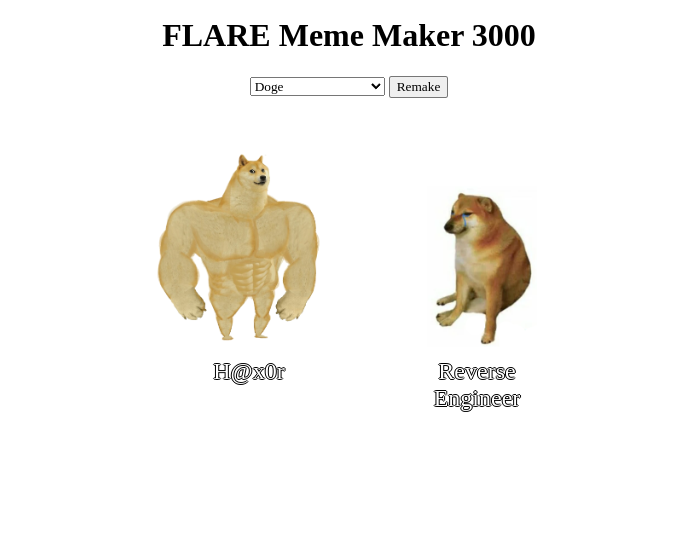

after deobfuscating with [de4js](https://de4js.kshift.me/) cleaning up my code looks as such :

```js
const meme_quotes = [
    'When you find a buffer overflow in legacy code',
    'Reverse Engineer',
    'When you decompile the obfuscated code and it makes perfect sense',
    'Me after a week of reverse engineering',
    'When your decompiler crashes',
    "It's not a bug, it'a a feature",
    "Security 'Expert'",
    'AI',
    "That's great, but can you hack it?",
    'When your code compiles for the first time',
    "If it ain't broke, break it",
    "Reading someone else's code",
    'EDR',
    'This is fine',
    'FLARE On',
    "It's always DNS",
    'strings.exe',
    "Don't click on that.",
    'When you find the perfect 0-day exploit',
    'Security through obscurity',
    'Instant Coffee',
    'H@x0r',
    'Malware',
    '$1,000,000',
    'IDA Pro',
    'Security Expert',
],
    meme_types = {
        doge1: [
            ['75%', '25%'],
            ['75%', '82%'],
        ],
        boy_friend0: [
            ['75%', '25%'],
            ['40%', '60%'],
            ['70%', '70%'],
        ],
        draw: [['30%', '30%']],
        drake: [
            ['10%', '75%'],
            ['55%', '75%'],
        ],
        two_buttons: [
            ['10%', '15%'],
            ['2%', '60%'],
        ],
        success: [['75%', '50%']],
        disaster: [['5%', '50%']],
        aliens: [['5%', '50%']],
},
    meme_images = {.....}

function a0f() {
    document.getElementById('caption1').hidden = true
    document.getElementById('caption2').hidden = true
    document.getElementById('caption3').hidden = true
    const a = document.getElementById('meme-template')
    var b = a.value.split('.')[0]
    meme_types[b].forEach(function (c, d) {
        var e = document.getElementById('caption' + (d + 1))
        e.hidden = false
        e.style.top = meme_types[b][d][0]
        e.style.left = meme_types[b][d][1]
        e.textContent = meme_quotes[Math.floor(Math.random() * (meme_quotes.length - 1))]
    })
}
a0f()
const a0g = document.getElementById('meme-image'),
      a0h = document.getElementById('meme-container'),
      a0i = document.getElementById('remake'),
      a0j = document.getElementById('meme-template')
a0g.src = meme_images[a0j.value]
a0j.addEventListener('change', () => {
    a0g.src = meme_images[a0j.value]
    a0g.alt = a0j.value
    a0f()
})
a0i.addEventListener('click', () => {
    a0f()
})
function checksum() {
    const a = a0g.alt.split('/').pop()
    if (a !== Object.keys(meme_images)[5]) {
        return
    }
    const b = a0l.textContent,
        c = a0m.textContent,
        d = a0n.textContent
    if (
        meme_quotes.indexOf(b) == 14 &&
        meme_quotes.indexOf(c) == meme_quotes.length - 1 &&
        meme_quotes.indexOf(d) == 22
    ) {
        var e = new Date().getTime()
        while (new Date().getTime() < e + 3000) { }
        var f =
            d[3] +
            'h' +
            a[10] +
            b[2] +
            a[3] +
            c[5] +
            c[c.length - 1] +
            '5' +
            a[3] +
            '4' +
            a[3] +
            c[2] +
            c[4] +
            c[3] +
            '3' +
            d[2] +
            a[3] +
            'j4' +
            meme_quotes[1][2] +
            d[4] +
            '5' +
            c[2] +
            d[5] +
            '1' +
            c[11] +
            '7' +
            meme_quotes[21][1] +
            b.replace(' ', '-') +
            a[11] +
            meme_quotes[4].substring(12, 15)
        f = f.toLowerCase()
        alert(atob('Q29uZ3JhdHVsYXRpb25zISBIZXJlIHlvdSBnbzog') + f)
    }
}
const a0l = document.getElementById('caption1'),
      a0m = document.getElementById('caption2'),
      a0n = document.getElementById('caption3')
a0l.addEventListener('keyup', () => {
    checksum()
})
a0m.addEventListener('keyup', () => {
    checksum()
})
a0n.addEventListener('keyup', () => {
    checksum()
})
```

so from my understanding i have to match the captions and ill get the flag, inside distracted boyfriend.


# 5 SSHD

We are given a giant `tar` file which is a copy of the entire Linux filesystem.
