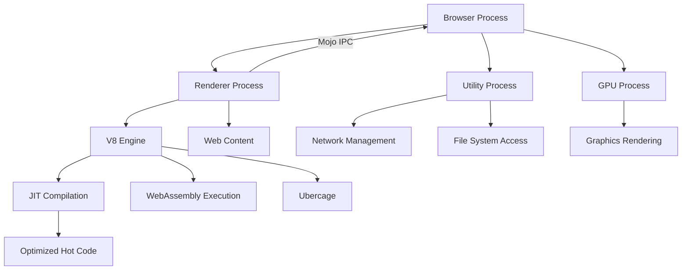
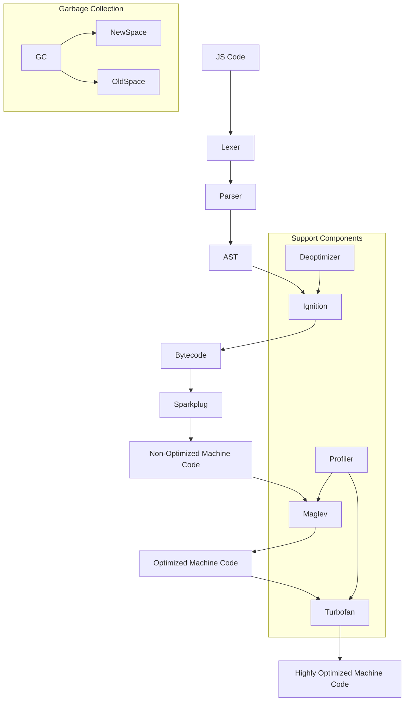

+++
title = 'Intro V8'
date = 2025-04-11T13:06:01+05:30
draft = false
summary = "Introduction to Javascript in Rendering"
[params]
  author = 'w1redch4d'
+++

## Preliminaries

Chrome uses a multi-process architecture:
- **Browser Process (Parent)**: Manages everything.
- **Renderer Process (Child)**: Handles tabs, extensions, iframes from different origins. Runs web content in a sandbox for security.
- **Utility Process**: Manages network and file system access.
- **GPU Process**: Manages graphics rendering.

Renderer Process Details:
- Everything from the internet runs here (because it’s untrusted).
- **Sandboxed**: Limited system access for safety.
- Communicates with Browser Process via Mojo IPC (Inter-Process Communication).
- IPC allows two processes to share information safely and efficiently.

V8 Engine:
- Chrome’s JavaScript and WebAssembly engine.
- Uses **JIT (Just-In-Time)** Compilation to convert code to machine code for faster execution.
- Optimizes frequently used code ("hot code") for near-native speed.

Security Upgrade - Ubercage (V8 Heap SBX):
- New sandboxing for V8 to protect against arbitrary memory access, even if renderer is compromised.

## JS Engine Pipeline (V8)
When JavaScript code runs in V8, it goes through several steps:
- [Lexer](https://source.chromium.org/chromium/chromium/src/+/main:v8/src/parsing/token.h)
    - Breaks the JS code into tokens (keywords, constants, operators, variables).
- [Parser](https://source.chromium.org/chromium/chromium/src/+/main:v8/src/parsing/parsing.cc)
    - Uses tokens to build an [AST (Abstract Syntax Tree)](https://source.chromium.org/chromium/chromium/src/+/main:v8/src/ast/ast.cc).
    - Checks if the code is valid.
- Ignition (Interpreter)
    - Converts AST into bytecode.
    - Runs the bytecode using a register-based machine model.

- Sparkplug (Baseline Compiler)
    - Converts bytecode into machine code.
    - No optimizations at this stage.
    - Works mostly as a dispatcher

- [Maglev (Mid-tier JIT Compiler)](https://source.chromium.org/chromium/chromium/src/+/main:v8/src/maglev/maglev.cc)
    - Some optimizations.
    - Generates faster machine code than Sparkplug.
    - Uses CFG for IR generation

- [Turbofan (High-end JIT Compiler)](https://source.chromium.org/chromium/chromium/src/+/main:v8/src/compiler/turbofan-enabled.cc)
    - Advanced optimizations.
    - Produces highly optimized machine code for performance.
    - Uses the concept of Sea Of Nodes

Supporting Components
- [Profiler](https://source.chromium.org/chromium/chromium/src/+/main:v8/src/profiler/profiler-stats.cc)
    - Monitors code at runtime.
    - Detects "hot code" (frequently executed code).
    - Sends it to the appropriate compiler for optimization.

- [Deoptimizer](https://source.chromium.org/chromium/chromium/src/+/main:v8/src/deoptimizer/deoptimizer.cc)
    - If assumptions made by JIT compiler fail, it stops JIT execution and falls back to the interpreter.

- Garbage Collector (GC)
    - Frees unused memory.

Uses Generational GC:
- **NewSpace**: For new objects.
- **OldSpace**: For objects that survive multiple GC cycles.

Two GC types:
- **Scavenger**: Cleans NewSpace.
- **Mark-compact**: Cleans OldSpace.

GC Interaction
Use `--expose-gc` with `d8` to access GC manually.
Trigger:
- `gc({"type":"scavenger"})` for Scavenger.
- `gc()` for Mark-compact.

Here’s a visual of the whole flow:

## Useful References:
- [V8 Doxygen Source](https://v8-docs.vercel.app)
- [Orinoco: The new V8 gc](https://www.youtube.com/watch?v=Scxz6jVS4Ls&t=683s)
- [V8 official docs](https://v8.dev)