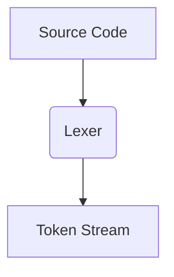
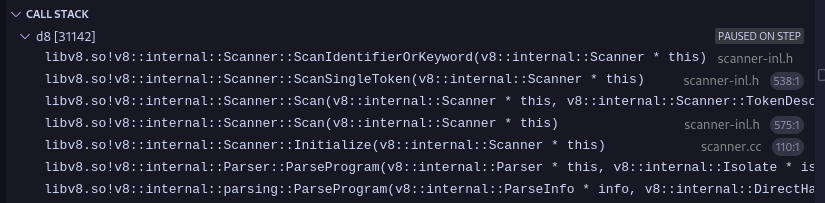
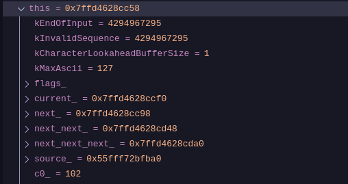
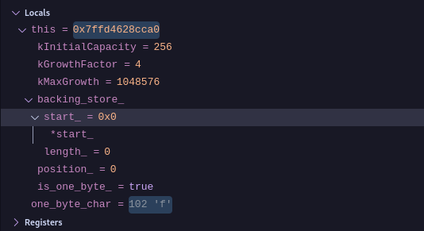

+++
title = 'Lexical Analysis'
date = 2025-04-13T08:44:23+05:30
draft = false
summary = 'Scanner, Token generation'
+++

# Introduction to Lexical Analysis

Lexical analysis, also known as scanning or tokenization, is the first phase of a compiler. It is responsible for reading the source code as a stream of characters and converting it into a stream of tokens. These tokens are the basic building blocks for the subsequent phases of the compiler, such as parsing and semantic analysis.

## Role of Lexical Analysis

The primary role of the lexical analyzer (lexer) is to break down the raw source code into meaningful units called **tokens**. These tokens represent elements like keywords, identifiers, operators, constants, and punctuation marks. By doing so, the lexer simplifies the input for the parser, which expects a sequence of tokens rather than a stream of individual characters.

Consider this example javascript code:

```js
let x, z = 0;
let y, a = 1;
if (x > y) {
    z = 1
} else {
    a = z;
}
```
To a computer this js source code, is just a stream of characters, separated by newlines, tabs and spaces, in this example lets assume that in computer's perspective the above source code will look as the following:
```
let<space>x,<space>z<space>=<space>0;\nlet<space>y,<space>a<space>=<space>1;\nif<space>(x<space>><space>y)<space>{\n\tz<space>=<space>1\n}<space>else<space>{\n\ta<space>=<space>z;\n}
```
where `"\n"` represents a newline, `"\t"` represents a tab and `<space>` represents the spaces which are there in the middle, the job for the interpreter is to now convert this stream of characters into a set of tokens. Now lets understand what do i mean by "a stream of tokens" in here, so basically we want to insert delimiters (`|`) into that stream of characters such that they distinguish one "character" from another : 

```js
let | x | , | z | = | 0 | ; let | y | , | a | = | 1 | ; if | ( | x | > | y | ) | { | z | = | 1 | ; | } | else | { | a | = | z | ; | }
```

so in this case the `if` word is one token (keyword token), and `x` is another token (identifier token), `\n` and `\t` or `<space>` for that matter are also tokens (whitespace tokens).

In the context of the V8 JavaScript engine, the **Lexer** is the first component in the JavaScript execution pipeline. It takes the JavaScript code and divides it into tokens such as keywords, constants, operators, and variables.


The **"Lexer"** for V8 is called **"scanner"** and can be found found in the directory [`./src/parsing`](https://v8-docs.vercel.app/dir_3fb67633942bd84f7aa391e58ba835b3.html) and the code that converts the stream of characters into token can be found here in the file [`scanner-inl.h`](https://v8-docs.vercel.app/scanner-inl_8h_source.html#l00351) along with [call graph for the function](https://v8-docs.vercel.app/classv8_1_1internal_1_1Scanner.html#a11ad4829073aee72344151129608643b).

**Important Note:** I am not using the official v8 source from the main refs as it is subject to change with newer commits in the future.

## Tokens, Lexemes, and Token Classes

-   **Token Class**: A token class (or token type) is a category of tokens that share a common set of properties. Examples include `kIdentifier`, `KEYWORD`, `INTEGER_LITERAL`, `OPERATOR`, etc..
-   **Lexeme**: A lexeme is the actual sequence of characters in the source code that matches the pattern for a token class. For example, `if` is a lexeme that belongs to the `KEYWORD` token class, and `count` is a lexeme that might belong to the `kIdentifier` token class.
-   **Token**: A token is a pair consisting of a token class and its corresponding lexeme (or sometimes additional attributes like the value of a literal). For example, the lexeme `42` would result in a token like `<INTEGER_LITERAL, "42">`.

## Token Class
A Token Class corresponds to a set of strings:
- **Identifier**: string of letters or digits starting with a letter.
- **Integer**: string of digits.
- **Keyword**: `if`,`else`,`let`,`for`,`while`...
- **Whitespaces**: sequence of spaces, newlines, tabs, etc.

The **Token class** source code for v8 can be found in the file [`token.h`](https://v8-docs.vercel.app/token_8h_source.html#l00211) along with the [`Token Class Reference`](https://v8-docs.vercel.app/classv8_1_1internal_1_1Token.html).

## Error Handling in Lexical Analysis

When the lexer encounters a sequence of characters that does not match any of the defined token class patterns, a lexical error occurs. A common approach to handle lexical errors is to define a special [**error token value**](https://v8-docs.vercel.app/token_8h_source.html#l00204). When no other pattern matches, the lexer can match the erroneous sequence (often just a single character) as an error token and [continue the scanning process](https://v8-docs.vercel.app/scanner-inl_8h_source.html#l00375). This allows the compiler to detect multiple errors in a single pass. Error tokens can contain the problematic lexeme and potentially an error message.

## Software Implementation of Lexical Analyzers
Lexical analyzers can be implemented in several ways. Two common approaches involve using finite automata:

-   **Deterministic Finite Automaton (DFA)**: A DFA can be directly implemented using a **transition table**. The rows of the table represent the states of the DFA, and the columns represent the input characters. Each entry in the table specifies the next state for a given state and input character. Executing a DFA involves starting at the initial state and following the transitions based on the input characters until the end of the input is reached. The final state indicates whether a valid token has been recognized. DFAs provide efficient linear-time scanning but can sometimes result in larger state machines compared to NFAs.

-   **Non-deterministic Finite Automaton (NFA)**: Regular expressions can be easily converted into NFAs. An NFA can have multiple possible next states for a given state and input character, as well as epsilon transitions (transitions without consuming any input). Simulating an NFA involves keeping track of the set of all possible states the automaton can be in at each step. While NFAs are often more compact than DFAs, their simulation can be slightly less efficient. However, tools can automatically convert regular expressions to NFAs and then to optimized DFAs for efficient lexical analysis.

Many lexical analyzer generators (like Lex or Flex) take a specification of token classes in the form of regular expressions and automatically generate efficient C code for a lexer based on DFA implementation. In case of V8 as well the lexical analyzer a.k.a [`scanner`](https://v8-docs.vercel.app/scanner-inl_8h_source.html#l00351) uses the DFA implementation on the [`token.h`](https://v8-docs.vercel.app/token_8h_source.html#l00211) file.

## Lexer in V8

In the V8 JavaScript engine, the **Lexer** is a crucial first step in processing JavaScript code. It takes the raw JavaScript source code and performs the following tasks:

-   Scans the input character by character.
-   Identifies sequences of characters that form lexemes.
-   Categorizes these lexemes into predefined token classes (e.g., keywords like `function`, identifiers like variable names, operators like `+`, literals like `"hello"` or `123`).
-   Produces a stream of tokens that is then passed to the **Parser**.

The V8 Lexer plays a vital role in the overall performance of the engine by efficiently breaking down the source code into a format that can be readily processed by subsequent stages of the compilation and execution pipeline.

Lets uncover how the lexer in v8 works with a testcase example:

```js
function is_greater(a){
	if(a > 1337){
		return "GREATER!!";
	}
}
console.log(is_greater(13337));
```
>Note: The test case is very simple, so it can’t cover the full flow of the scanner.

The function [`Scanner::ScanSingleToken()`](https://v8-docs.vercel.app/scanner-inl_8h_source.html#l00351) serves as the entry point for scanning individual tokens within the V8 engine. At this stage, the `c0_` variable is already initialized to point to the first character of the js source code stream. In the provided test scenario, `c0_` references the character `'f'`. Let us examine the workflow in detail. Early in the function, specifically by the [fifth line of code](https://v8-docs.vercel.app/scanner-inl_8h_source.html#l00360), there is a check to determine if `c0_` contains a character within the ASCII range. Given that `c0_` holds `'f'`, this condition evaluates to true. Following this, the [sixth line](https://v8-docs.vercel.app/scanner-inl_8h_source.html#l00361) references the [`one_char_tokens`](https://v8-docs.vercel.app/scanner-inl_8h_source.html#l00180) data structure — a predefined template in V8 consisting of an array of character types. This structure is segmented into several logical components, which classify characters accordingly. In this case, `'f'` is recognized as an ASCII identifier via the [`IsAsciiIdentifier(c)`](https://v8-docs.vercel.app/char-predicates-inl_8h_source.html#l00026) method, categorizing it under the [`Token::kIdentifier`](https://v8-docs.vercel.app/token_8h_source.html#l00178) type. Within the `ScanSingleToken()` function, given that `c0_` is classified as `Token::kIdentifier`, the scanner delegates further processing to the [`ScanIdentifierOrKeyword()`](https://v8-docs.vercel.app/char-predicates-inl_8h_source.html#l000188) method. This method orchestrates a series of operations that manage the relationships between relevant classes during token scanning. The image below illustrates the call stack associated with these operations:



Before advancing to subsequent characters, the current character (`'f'`) must be preserved. The scanner utilizes a window structure for this purpose. Specifically, the [`one_byte_char`](https://v8-docs.vercel.app/literal-buffer_8h_source.html#l00088) variable holds the value of `c0_`, which is then stored in the [`backing_store_`](https://v8-docs.vercel.app/literal-buffer_8h_source.html#l000100). We can verify this claim by checking the variable window in the vscode debug view with the current value of our `c0_` variable.



Figure-1


           
Figure-2

As we can see the value of `c0_` (102) in Figure-1 is the same as `one_byte_char` (102) in Figure-2 and 102 in ascii translates to `f`.
The [`AdvanceUntil()`](https://v8-docs.vercel.app/scanner_8h_source.html#l00077) method proceeds to iterate over each character sequentially, terminating upon encountering a designated terminator character. As depicted in Figure 3, this process results in the collection of the first eight characters, which form the string `"function"` in our example.

At this point, a complete token has been successfully accumulated. The subsequent step involves determining whether this token represents a reserved keyword or a general identifier. This classification is handled by the [`GetToken()`](https://v8-docs.vercel.app/keywords-gen_8h_source.html#l00223) method, which performs a straightforward lookup in a predefined hash table to retrieve the token type. Figure 4 provides an overview of the key members of [this hash table](https://v8-docs.vercel.app/keywords-gen_8h_source.html#l00093).

As a result of this process, the token corresponding to the string `"function"` is correctly identified and assigned the type [`Token::kFunction`](https://v8-docs.vercel.app/keywords-gen_8h_source.html#l00106). Similarly, for the token `"is_greater"`, the system assigns the type [`Token::kIdentifier`](https://v8-docs.vercel.app/token_8h_source.html#l00178), following the same mechanism.

Here is the control flow graph of the codeflow:

```mermaid
graph TD
    A[Start: ScanSingleToken] --> B[c0_ points to first character 'f']
    B --> C{Is c0_ ASCII?}
    C -- Yes --> D[Check one_char_tokens]
    D --> E{IsAsciiIdentifier?}
    E -- Yes --> F[Token type: Token::kIdentifier]
    F --> G[Call ScanIdentifierOrKeyword]
    G --> H[Save current character 'f' in window -> backing_store_]
    H --> I[Call AdvanceUntil]
    I --> J[Read characters until terminator]
    J --> K[Collect string 'function']
    K --> L[Token complete]
    L --> M[Call GetToken]
    M --> N[Lookup token in predefined hash table]
    N --> O{Is keyword?}
    O -- Yes --> P[Token type: Token::kFunction]
    P --> S[Advance to next token: 'is_greater']
    
    S --> T[c0_ points to first character 'i']
    T --> U{Is c0_ ASCII?}
    U -- Yes --> V[Check one_char_tokens]
    V --> W{IsAsciiIdentifier?}
    W -- Yes --> X[Token type: Token::kIdentifier]
    X --> Y[Call ScanIdentifierOrKeyword]
    Y --> Z[Save current character 'i' in window -> backing_store_]
    Z --> AA[Call AdvanceUntil]
    AA --> AB[Read characters until terminator]
    AB --> AC[Collect string 'is_greater']
    AC --> AD[Token complete]
    AD --> AE[Call GetToken]
    AE --> AF[Lookup token in predefined hash table]
    AF --> AG{Is keyword?}
    AG -- No --> AH[Token type: Token::kIdentifier 'is_greater']
    AH --> R[End]

    AG -- Yes --> AI[Token type: Token::kFunction] 
    AI --> R[End]

    P --> R[End]
```

