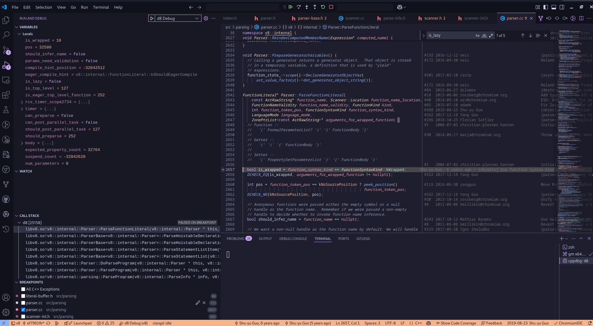
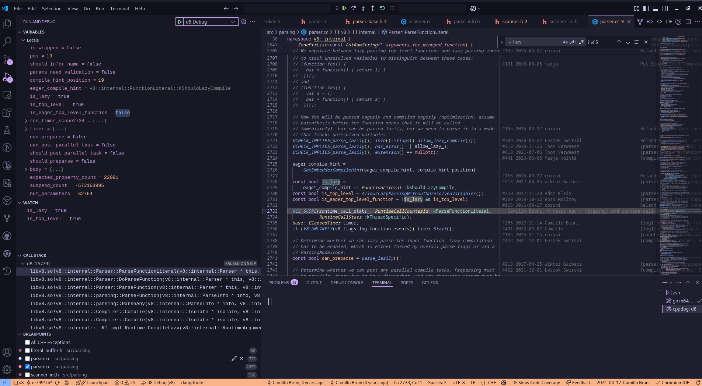

# Compilation Parser And AST

Parsing is the next phase after [Lexical Analysis](https://w1redch4d.github.io/post/lexical-analysis/) . It takes the stream of tokens generated by the lexer as input and constructs a hierarchical structure (like an [AST](https://en.wikipedia.org/wiki/Abstract_syntax_tree)) that represents the grammatical structure of the program according to the language's syntax and [rules](https://262.ecma-international.org/6.0/) . The [**parser**](https://v8-docs.vercel.app/parser_8cc_source.html) checks if the sequence of tokens forms a valid program in the language.

In V8's pipeline, the parser receives the tokens from the lexer and produces the [Abstract Syntax Tree (AST)](https://v8-docs.vercel.app/ast_8cc_source.html) . This AST serves as the foundation for subsequent stages like bytecode generation by the Ignition interpreter and optimizations by the JIT compilers (Sparkplug, Maglev, Turbofan).


graph TD
    A[Tokens] --> B(Parser);
    B --> C(Abstract Syntax Tree);



## Parser in V8

In the V8 JavaScript engine, once the scanner completes its job, the next critical component in the compilation pipeline is the **"parser"**. The scanner produces a [sequence of tokens](https://w1redch4d.github.io/post/lexical-analysis/#token-class), which serve as the primary input for the parser. As the parser works through the process of compiling JavaScript code, it continuously interacts with the scanner, frequently invoking it to supply the next set of tokens needed for parsing. To understand this interaction more deeply, we can examine a specific part of the parser’s implementation. A good starting point for this exploration is the [`DoParseProgram`](https://v8-docs.vercel.app/parser_8cc_source.html#l00714) function, which plays a central role in initiating the parsing of JavaScript programs. By analyzing this function, we can gain valuable insights into how the parser operates and how it coordinates with the scanner during the compilation process.

The `result` variable [defined in the function](https://v8-docs.vercel.app/parser_8cc_source.html#l00725) in this case will later hold the Abstract Syntax Tree (AST). The AST is a structured representation of the JavaScript code that the parser builds as it processes the tokens. Once the `DoParseProgram()` function finishes its execution, the complete AST is generated and stored in this `result` variable. In the context of our example, after the AST has been successfully constructed, the program proceeds to invoke the next method in the compilation sequence, which continues the process based on the parsed and structured code. However following [our testcase back in the previous module](https://w1redch4d.github.io/post/lexical-analysis/#lexer-in-v8) the [`ParseStatementList`](https://v8-docs.vercel.app/parser-base_8h_source.html#l05638) method will be called, it is responsible for parsing the program statements. Inside the method when [`peek` is called](https://v8-docs.vercel.app/parser-base_8h_source.html#l05644) , it takes out the type of the token, for our testcase the type obtained by the [`peek`](https://v8-docs.vercel.app/scanner_8h_source.html#l00326) method is `Token::kFunction` hence the result of the first while loop in the method is false and it jumps to [the second while loop](https://v8-docs.vercel.app/parser-base_8h_source.html#l05692) and invokes the method [`ParseStatementListItem()`](http://v8-docs.vercel.app/parser-base_8h_source.html#l05702). After the function is called we hit a large [switch case](https://v8-docs.vercel.app/parser-base_8h_source.html#l05722) which takes actions based on the token type determined by the `peek()` method , since our token type is `Token::kFunction` we hit the [`return ParseHoistableDeclaration(nullptr, false);`](https://v8-docs.vercel.app/parser-base_8h_source.html#l05724) and the [`ParseHoistableDeclaration(ZonePtrList<const AstRawString>* names, bool default_export)`](https://v8-docs.vercel.app/parser-base_8h_source.html#l04655) method is called. Inside the method we encouter [`Consume(Token::kFunction);`](https://v8-docs.vercel.app/parser-base_8h_source.html#l04658), that [`Consume(Token::Value token)`](https://v8-docs.vercel.app/parser-base_8h_source.html#l00941) method is the token cache we talked about in the [JS Engine Pipeline of V8's parser in the first article Intro to V8](https://w1redch4d.github.io/post/intro-v8/#js-engine-pipeline-v8). After obtaining the token type , we need to figure out [which `FunctionKind` the function is](https://v8-docs.vercel.app/parser-base_8h_source.html#l04715). The `Token::kFunction` and [`FunctionKind`](https://v8-docs.vercel.app/function-kind_8h_source.html#l00014) serves two different purposes as, `Token::kFunction` is just a part of the JS Engine pipeline in V8 but `FunctionKind` is an [ECMA Specs](https://262.ecma-international.org/6.0/#sec-ecmascript-function-objects). Now that the parsing part is complete, here is a basic control flow view of the parser in V8 with our testcase :


graph TD
  A[Start: DoParseProgram] --> B[AST Generation]
  B --> C[ParseStatementList]

  C --> D{peek == Token::kString?}
  D -- Yes --> E[ParseStatementListItem]
  E --> F{IsNull - stat?}
  F -- Yes --> G[Return]
  F -- No --> H[Add stat to body]
  H --> I{IsStringLiteral - stat?}
  I -- No --> J[Break loop]
  I -- Yes --> K{use_strict?}
  K -- Yes --> L[RaiseLanguageMode - kStrict]
  L --> M{scope->HasSimpleParameters?}
  M -- No --> N[ReportMessageAt and Return]
  M -- Yes --> D
  K -- No --> O[RaiseLanguageMode - kSloppy] --> D

  D -- No --> P{peek != end_token}
  P -- Yes --> Q[ParseStatementListItem]
  Q --> R{IsNull - stat?}
  R -- Yes --> S[Return]
  R -- No --> T{IsEmptyStatement?}
  T -- Yes --> P
  T -- No --> U[Add stat to body] --> P
  P -- No --> V[End of ParseStatementList]

  Q --> W[ParseHoistableDeclaration]
  W --> X[Consume - Token::kFunction]
  X --> Y[Check - Token::Mul?]
  Y -- Yes --> Z[Set flags]
  Y -- No --> AA[flags = kIsNormal]
  Z --> AB[ParseHoistableDeclaration - pos, flags,...]
  AA --> AB
  AB --> AC[Determine FunctionKind]
  AC --> AD{kNormalFunction?}
  AD -- Yes --> AE[Parse Token::kIdentifier]
  AE --> AF[Parse Complete]


## Parser Optimization Techniques in V8

**Lazy Parsing** is an optimization technique in V8 , where the main idea is that the JavaScript code is not fully analyzed or processed (i.e., parsed) until it's actually needed — meaning, until the moment it is about to be executed.
In many programs, some parts of the code might never run. For example, code inside an `if` statement might not execute if the condition is `false`, or a function might never be called. So, parsing everything right away can waste time and memory.
To avoid this, V8 delays the parsing of such code until it's absolutely necessary — this is what we call lazy parsing. Similarly, it also delays turning the code into executable machine code, which is known as lazy compilation.
By using both lazy parsing and lazy compilation, V8 can run JavaScript more efficiently, especially when dealing with large programs where not all code is used.

For example , in our case, the `is_greater`’s type is kNormalFunction, which is the function to be executed immediately, so we need to parse it immediately., hence After analyzing the function name (`is_greater`), [`ParseFunctionLiteral`](https://v8-docs.vercel.app/parser_8cc_source.html#l02642) will be called, which is responsible for parsing the function body.

Referring back to our testcase :

```js
function is_greater(a){
        if(a > 1337){
                return "GREATER!!";
        }
}
console.log(is_greater(13337));
```

You’ll notice that the function `is_greater` is not executed right away when the program run as first. This behavior meets the condition for lazy parsing. In other words, because the function is not immediately needed, V8 chooses to delay parsing it until it actually gets called.

We can understand this better by looking at the JavaScript code. First, `console.log()` is executed. Inside that `console.log()` call, the function `is_greater` is then invoked. Since `is_greater` is not used until later, V8 doesn’t need to parse it immediately — which is exactly what lazy parsing aims to optimize.

To confirm this behavior, we can use debugging tools and take a closer look at how V8 handles this function. One way is by setting a breakpoint in the `ParseFunctionLiteral` method, which is responsible for parsing function definitions. Here is the initial breakpoint screenshot from the debug:



Notice in the callstack , the functions which are being executed is the same as we discussed above, also lets watch the `is_lazy` and `is_top_level` variables and see how they changes with further debugging.



From this, we observe that two important member variables — `is_lazy` and `is_top_level` — are both set to `true`. This strongly supports our earlier claim: the function is parsed lazily and is recognized as a top-level function that doesn’t need to be parsed right away.

Additionally, we can inspect the **Abstract Syntax Tree (AST)** — a structural representation of the code — by running the following command:

```
./out/x64.debug/d8 --print-ast ../test.js                                                                                    ─╯
[generating bytecode for function: ]
--- AST ---
FUNC at 0
. KIND 0
. LITERAL ID 0
. SUSPEND COUNT 0
. NAME ""
. INFERRED NAME ""
. DECLS
. . FUNCTION "is_greater" = function is_greater
. EXPRESSION STATEMENT at 66
. . kAssign at -1
. . . VAR PROXY local[0] (0x557657fd24c8) (mode = TEMPORARY, assigned = true) ".result"
. . . CALL
. . . . PROPERTY at 74
. . . . . VAR PROXY unallocated (0x557657fd2588) (mode = DYNAMIC_GLOBAL, assigned = false) "console"
. . . . . NAME log
. . . . CALL
. . . . . VAR PROXY unallocated (0x557657fd2370) (mode = VAR, assigned = true) "is_greater"
. . . . . LITERAL 13337
. RETURN at -1
. . VAR PROXY local[0] (0x557657fd24c8) (mode = TEMPORARY, assigned = true) ".result"

[generating bytecode for function: is_greater]
--- AST ---
FUNC at 19
. KIND 0
. LITERAL ID 1
. SUSPEND COUNT 0
. NAME "is_greater"
. INFERRED NAME ""
. PARAMS
. . VAR (0x557657fd2400) (mode = VAR, assigned = false) "a"
. DECLS
. . VARIABLE (0x557657fd2400) (mode = VAR, assigned = false) "a"
. IF at 25
. . CONDITION at 30
. . . kGreaterThan at 30
. . . . VAR PROXY parameter[0] (0x557657fd2400) (mode = VAR, assigned = false) "a"
. . . . LITERAL 1337
. . THEN at -1
. . . BLOCK at -1
. . . . RETURN at 41
. . . . . LITERAL "GREATER!!"
```

In the next blog i will delve deeper into bytecode generation and maybe a case study of a bug thats related to it. Thanks for reading :D